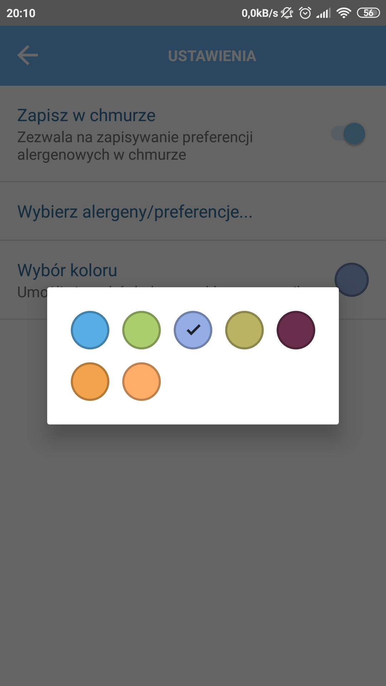
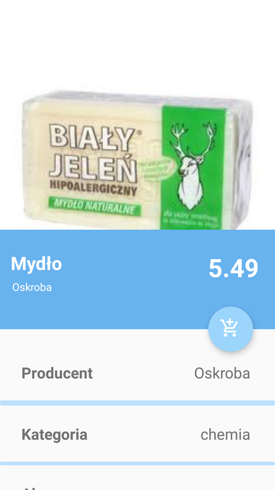

# ARsel

 

ARsel jest to sklepowy system rozszerzonej rzeczywistości, realizowany w ramach projektu zespołowego na Poltechnice Wrocławskiej. W założeniu miał być alternatywą dla droższych, nowo wprowadzanych etykiet elektronicznych ESEL (Electronic Shelf Edge Label). Na półkach cenowych, zamiast tradycyjnych cen, miałyby się znaleźć specjalne obrazki-etykiety. Następnie, za pomocą aplikacji mobilnej, etykiety są podmieniane na generowane etykiety cenowe.

 

Niniejsze repozytorium opisuje aplikację mobilną, napisaną pod system Android. Była realizowana w ramach Projektu Zespołowego, a następnie kontynuowana w ramach Pracy Inżynierskiej przez Rafała Koconia. Aplikacja umożliwia wyświetlanie etykiet generowanych w rozszerzonej rzeczywistości, podmieniając rzeczywiste papierowe etykiety.

Oprócz wyświetlania ceny i nazwy, aplikacja umożliwia:
* wybór szaty graficznej wyświetlanych etykiet,
* ustawienie preferencji alergenowych
* zmiana kolorów etykiet dla specjalnych przypadków (promocja, produkt z alergenem),
* tworzenie listy aktualnych zakupów,
* (opcjonalnie) odczyt nazw produktów za pomocą wbudowanego w system syntezatora mowy.

 
 
 
 

Link do pliku APK aplikacji: https://drive.google.com/file/d/1QsY2JE0u9qMCswIVdN1FxXmOK-KNqdKl/view

 
 
 

